## 🔄 核心数据处理流程

### 📊 完整处理流程图

```mermaid
graph TB
    %% 阶段标注
    subgraph PHASE1["🎯 第一阶段：需求理解到SQL生成完成"]
        A["👤 用户输入<br/>自然语言查询<br/>例如：生成逾期率分析报告"] --> B["🧠 AI意图识别<br/>🤖 AI价值：智能理解业务需求<br/>- 逾期率分析<br/>- 客群分析<br/>- 财务分析"]
        B --> C["🔍 AI Schema检索<br/>🤖 AI价值：智能匹配相关表结构<br/>- RAG向量化检索<br/>- 相关表智能推荐<br/>- 字段语义映射"]
        C --> D["📝 AI SQL生成<br/>🤖 AI价值：自动生成复杂SQL<br/>- LLM驱动生成<br/>- 提示工程优化<br/>- 复杂查询构建"]
    end

    %% 阶段分界线
    D --> CHECKPOINT["🚦 阶段检查点<br/>SQL生成完成<br/>- 意图已识别<br/>- Schema已检索<br/>- SQL已生成<br/>- 准备进入修复执行阶段"]

    subgraph PHASE2["⚡ 第二阶段：智能SQL修复到分析报告"]
        %% SQL修复阶段
        CHECKPOINT --> E["🔧 AI智能SQL修复<br/>🤖 AI价值：自动解决兼容性问题<br/>- Doris兼容性修复<br/>- 中文别名智能修复<br/>- 函数自动替换<br/>- 语法智能优化"]
        E --> F{"✅ SQL验证<br/>语法检查<br/>语义验证"}

        %% 查询执行阶段
        F -->|通过| G["🗄️ 数据库执行<br/>Apache Doris<br/>- 查询优化<br/>- 结果集返回<br/>- 错误处理"]
        F -->|失败| E

        %% 数据处理阶段
        G --> H["📊 DataFrame处理<br/>Pandas数据处理<br/>- 数据清洗<br/>- 类型转换<br/>- 缺失值处理"]
        H --> I["🧮 统计计算<br/>Python计算引擎<br/>- 基础统计量<br/>- 趋势分析<br/>- 业务指标计算"]

        %% 智能分析阶段
        I --> J["🤖 AI场景识别<br/>🤖 AI价值：智能识别业务场景<br/>- 关键词智能检测<br/>- 数据特征分析<br/>- 分析类型确定"]
        J --> K["📈 AI数据驱动分析<br/>🤖 AI价值：深度数据洞察<br/>- 统计特征提取<br/>- 趋势智能识别<br/>- 异常自动检测"]

        %% AI报告生成阶段
        K --> L["🧠 AI洞察生成<br/>🤖 AI价值：专业业务洞察<br/>- 业务知识库应用<br/>- 上下文深度理解<br/>- 专业见解生成"]
        L --> M["📋 AI报告结构化<br/>🤖 AI价值：智能报告组织<br/>- 关键发现提炼<br/>- 业务建议生成<br/>- 风险智能提示"]

        %% 输出格式化阶段
        M --> N{"🎨 输出模式选择"}
        N -->|Simple模式| O["📄 Markdown格式<br/>用户友好<br/>- 清晰排版<br/>- 图表嵌入<br/>- 易于阅读"]
        N -->|Enhanced模式| P["🖥️ Chart-View格式<br/>前端渲染<br/>- 交互式图表<br/>- 动态展示<br/>- 丰富视觉"]

        %% 最终输出
        O --> T["✨ 最终报告<br/>完整分析报告<br/>- 执行摘要<br/>- 详细分析<br/>- 可视化图表<br/>- 业务建议"]
        P --> T
    end

    %% 样式定义
    classDef phase1 fill:#e3f2fd,stroke:#0d47a1,stroke-width:3px
    classDef phase2 fill:#f3e5f5,stroke:#4a148c,stroke-width:3px
    classDef checkpoint fill:#fff9c4,stroke:#f57f17,stroke-width:3px
    classDef userInput fill:#e1f5fe,stroke:#01579b,stroke-width:2px
    classDef aiProcess fill:#fff3e0,stroke:#e65100,stroke-width:3px
    classDef sqlProcess fill:#f3e5f5,stroke:#4a148c,stroke-width:2px
    classDef dataProcess fill:#e8f5e8,stroke:#1b5e20,stroke-width:2px
    classDef output fill:#fce4ec,stroke:#880e4f,stroke-width:2px

    class PHASE1 phase1
    class PHASE2 phase2
    class CHECKPOINT checkpoint
    class A userInput
    class B,C,D,E,J,K,L,M aiProcess
    class F,G sqlProcess
    class H,I dataProcess
    class N,O,P,T output
```

### 🎯 两阶段处理架构说明

#### **🎯 第一阶段：需求理解到SQL生成完成**
- **核心任务**: 从用户需求理解到SQL生成的完整流程
- **具体步骤**:
  - **用户输入**: 接收自然语言查询
  - **🤖 AI意图识别**: 智能判断分析类型（逾期率、客群、财务等）
    - **AI价值**: 准确理解复杂业务需求，支持多种分析场景
  - **🤖 AI Schema检索**: 使用RAG技术智能检索相关表结构
    - **AI价值**: 自动匹配最相关的表和字段，减少人工配置
  - **🤖 AI SQL生成**: LLM驱动的智能SQL构建
    - **AI价值**: 自动生成复杂SQL查询，支持多表关联和复杂逻辑
- **输出**: 完整可执行的SQL查询语句
- **关键技术**: 自然语言理解 + RAG检索 + LLM生成
- **阶段特点**: AI密集型处理，完成从需求到SQL的智能转换

#### **⚡ 第二阶段：智能SQL修复到分析报告**
- **核心任务**: 从SQL修复到最终报告的完整数据处理流程
- **具体步骤**:
  1. **🤖 AI智能SQL修复**: 4层修复架构解决兼容性问题
     - **AI价值**: 自动解决95%的SQL兼容性问题，无需人工干预
  2. **数据查询**: Apache Doris数据库执行
  3. **数据处理**: Pandas数据清洗和统计计算
  4. **🤖 AI场景识别**: 智能识别业务分析场景
     - **AI价值**: 自动判断数据特征，选择最适合的分析方法
  5. **🤖 AI数据驱动分析**: 深度数据洞察和趋势识别
     - **AI价值**: 发现人工难以察觉的数据模式和异常
  6. **🤖 AI洞察生成**: 基于业务知识库的专业洞察
     - **AI价值**: 提供专业级业务见解和风险提示
  7. **🤖 AI报告结构化**: 智能组织分析结果
     - **AI价值**: 自动生成结构化报告，提炼关键发现
- **输出**: 完整的专业数据分析报告
- **关键技术**: 智能修复 + 数据驱动分析 + AI洞察生成
- **阶段特点**: 重量级处理，AI贯穿整个分析流程，确保专业性

### 🔧 执行要点

1. **自动化程度高**: 用户只需输入自然语言，系统自动完成所有处理
2. **错误自愈能力**: SQL修复器自动解决95%的兼容性问题
3. **数据驱动**: 100%基于真实数据计算，确保分析准确性
4. **双模式输出**: 同时满足简单阅读和复杂展示需求

---
